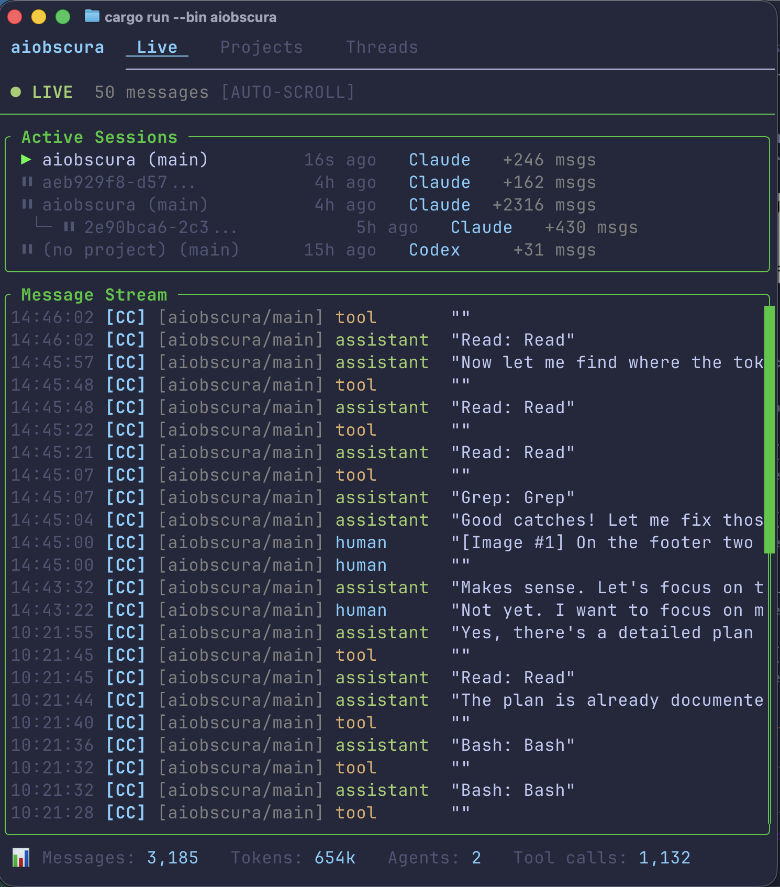
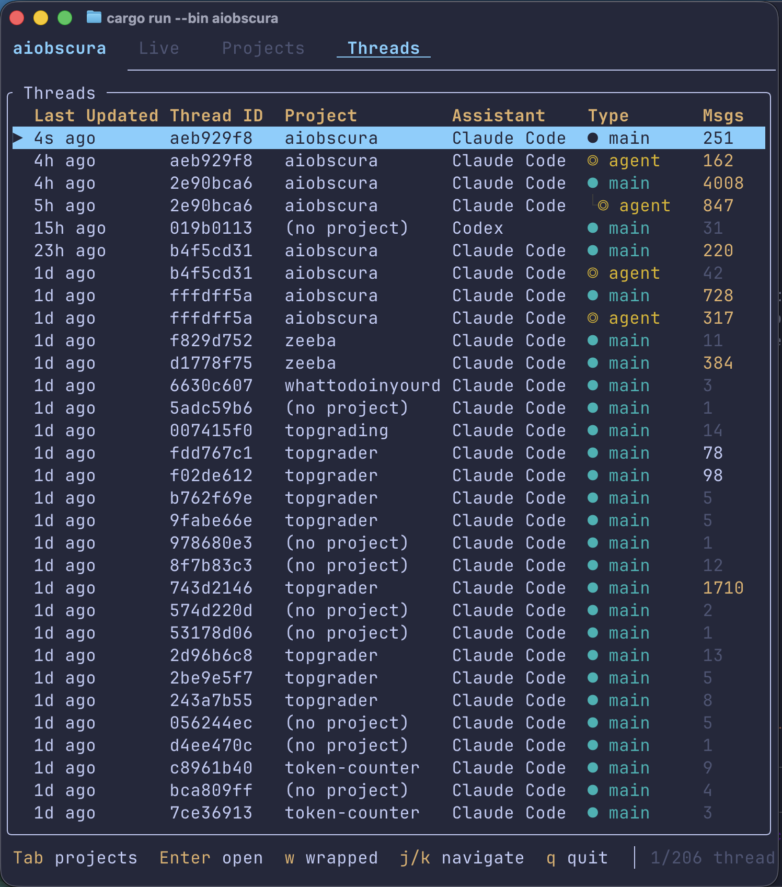
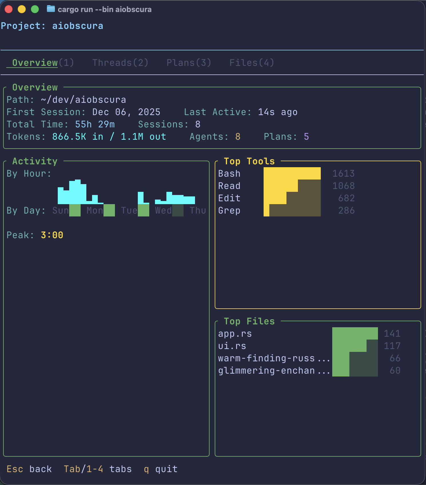
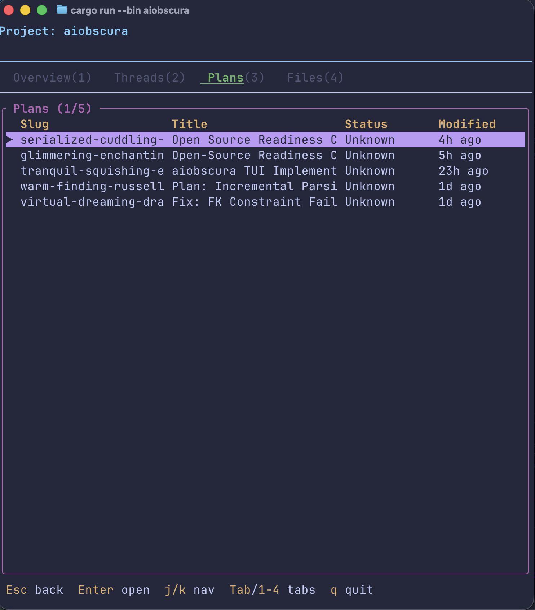
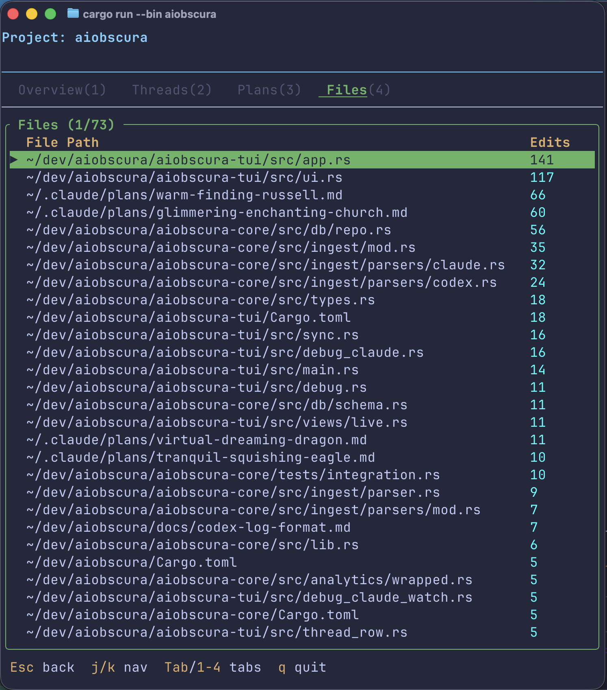
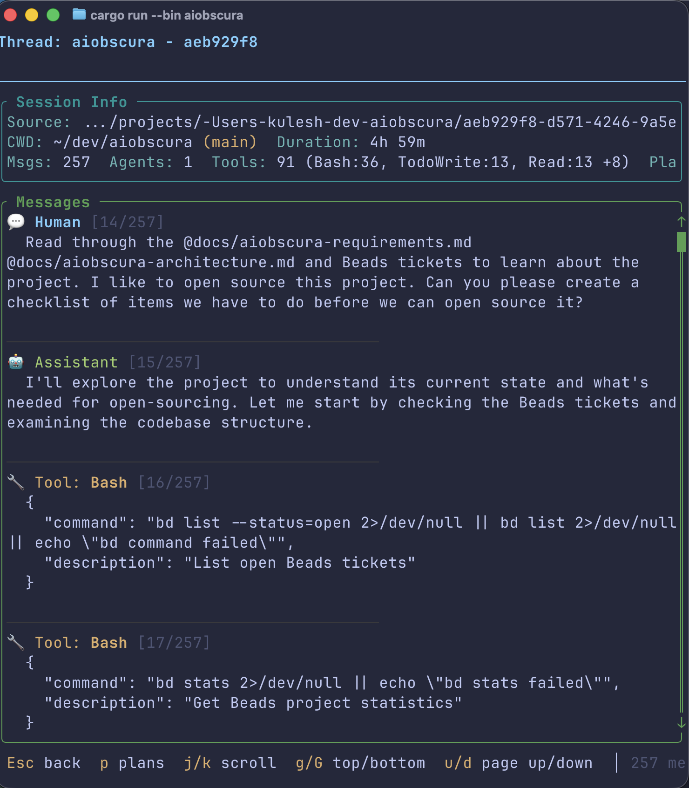
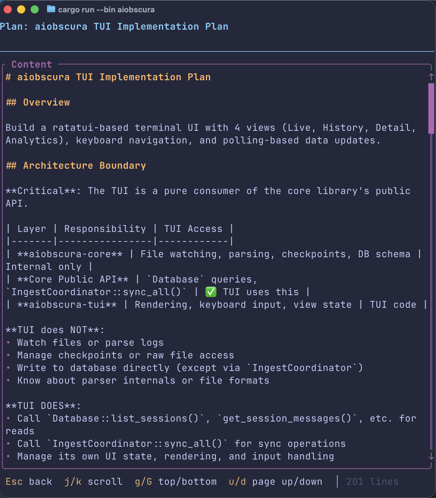
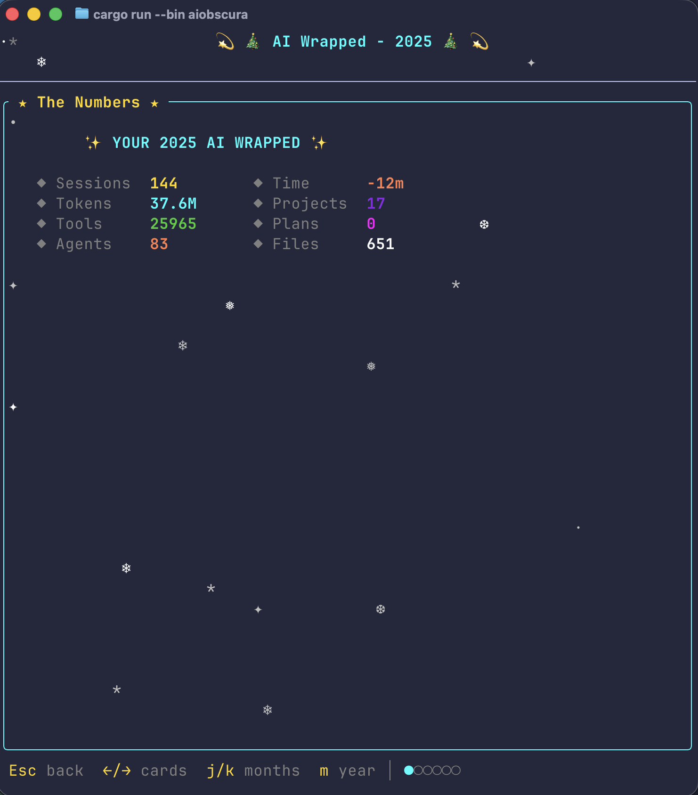
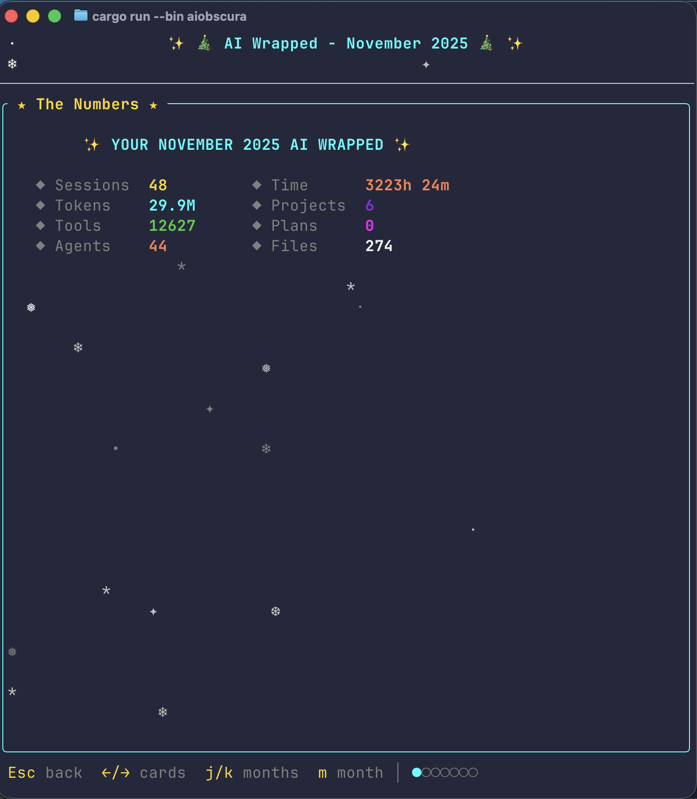

# aiobscura

[](https://github.com/kulesh/aiobscura/actions/workflows/ci.yml)
[](LICENSE-MIT)

AI Agent Activity Monitor - A tool for observing, querying, and analyzing activity from AI coding assistants.

## Overview

aiobscura ingests activity logs from AI coding assistants (Claude Code, Codex, Aider, Cursor) and provides:

- **Unified storage** - Normalized SQLite database with lossless raw data preservation
- **Session tracking** - Monitor active and historical coding sessions
- **Analytics** - Token usage, tool call patterns, activity streaks
- **Terminal UI** - Real-time monitoring and historical exploration

## Screenshots

### Live View

Watch your AI coding sessions in real-time. See active sessions across multiple agents, with a live message stream showing prompts, responses, and tool calls as they happen.



### Projects View

Browse all your projects with aggregate statistics. See session counts, total tokens used, activity streaks, and when each project was last active.


### Threads View

Explore individual conversation threads across all projects. Filter by assistant type (Claude Code, Codex), see message counts, and identify main threads vs. spawned agents.



### Project Detail

Drill into a specific project to see activity patterns by hour and day, top tools used, and most frequently edited files.



### Plans Browser

View Claude Code plan files associated with each project. Plans capture the assistant's implementation strategies and can be opened for detailed review.



### Files Touched

See which files the AI assistant has edited most frequently, helping identify hotspots in your codebase.



### Thread Detail

Read through full conversation history with syntax-highlighted messages. See human prompts, assistant responses, and tool calls with their arguments.



### Plan Viewer

Read plan documents with markdown rendering directly in the terminal.



### AI Wrapped

Get a "Spotify Wrapped" style summary of your AI coding activity - yearly or monthly. See total sessions, tokens, tools used, and more with a festive animated display.




## Installation

### Homebrew (macOS/Linux)

```bash
brew install kulesh/tap/aiobscura
```

### From source

Requires Rust 1.78 or later.

```bash
git clone https://github.com/kulesh/aiobscura.git
cd aiobscura
cargo build --release
```

The binary will be at `target/release/aiobscura`.

### Running

```bash
# First, sync your AI agent logs to the database
aiobscura-sync

# Then launch the TUI
aiobscura

# Or run sync in watch mode (background) to keep data fresh
aiobscura-sync --watch &
aiobscura
```

The sync command will:
1. Scan for installed AI agents (Claude Code, Codex, etc.)
2. Create a SQLite database at `~/.local/share/aiobscura/data.db`
3. Ingest available session logs (incremental - only new data)

The TUI reads from this database to display your activity.

## Supported Agents

| Agent       | Location        | Status      |
|-------------|-----------------|-------------|
| Claude Code | `~/.claude/`    | Supported   |
| Codex       | `~/.codex/`     | Supported   |
| Aider       | `.aider.*`      | Planned     |
| Cursor      | `~/.cursor/`    | Planned     |

## Project Structure

```
aiobscura/
├── aiobscura-core/     # Core library (parsing, storage, analytics)
├── aiobscura/          # Terminal UI and sync binaries
├── docs/               # Architecture and requirements
└── tests/              # Integration tests
```

## Development

```bash
# Build
cargo build

# Run tests
cargo nextest run  # or cargo test

# Lint
cargo clippy

# Format
cargo fmt
```

See [CONTRIBUTING.md](CONTRIBUTING.md) for detailed guidelines.

## Status

This project is under active development. See the [docs/](docs/) folder for architecture and requirements documentation.

## License

Licensed under either of:

- Apache License, Version 2.0 ([LICENSE-APACHE](LICENSE-APACHE) or http://www.apache.org/licenses/LICENSE-2.0)
- MIT license ([LICENSE-MIT](LICENSE-MIT) or http://opensource.org/licenses/MIT)

at your option.

## Contributing

Unless you explicitly state otherwise, any contribution intentionally submitted for inclusion in the work by you, as defined in the Apache-2.0 license, shall be dual licensed as above, without any additional terms or conditions.

See [CONTRIBUTING.md](CONTRIBUTING.md) for how to get started.
